<p align="center">
  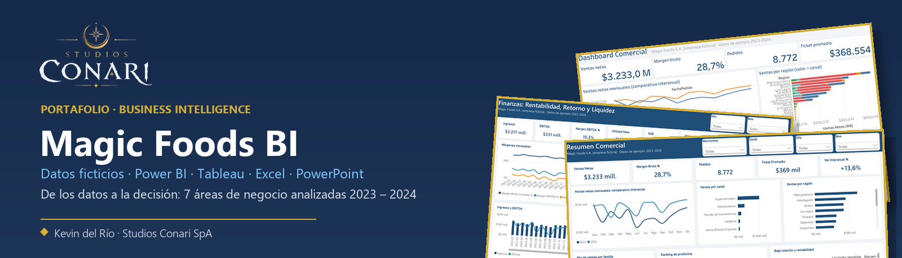
</p>

<h1 align="center">✦ Magic Foods BI</h1>

<p align="center">
  <strong>De los datos a la decisión.</strong><br>
  Plataforma de Business Intelligence de punta a punta para una empresa ficticia de alimentos frescos:<br>
  datos, modelo, dashboards y presentaciones ejecutivas con recomendaciones de acción.
</p>

<p align="center">
  
  
  
  
  
  
</p>

---

## ✦ Sobre el proyecto

Entre 2022 y 2025 lideré el área de Tecnologías de la Información de una empresa manufacturera de alimentos, donde diseñé e implementé la **plataforma de BI corporativa**: procesos ETL, modelos de datos, medidas DAX y tableros para la gerencia y las jefaturas de área. Esos datos son **confidenciales**, así que este repositorio **reconstruye el mismo trabajo con una empresa ficticia**: *Magic Foods S.A.*, una planta de alimentos frescos en Concepción que vende a clientes de las **16 regiones de Chile**.

Los datos no son aleatorios sin sentido: están diseñados con reglas de negocio para que el análisis tenga algo que descubrir. Incluyen estacionalidad, crecimiento interanual, productos de bajo margen, clientes morosos, una inversión que presiona la caja y un cambio de proceso con efecto medible.

> **Todo el contenido es ficticio.** Nombres de personas, clientes y proveedores fueron generados al azar y no corresponden a entidades reales.

### Qué incluye

| | |
|---|---|
| 🗃️ **Datos** | 8 libros de Excel con tablas estructuradas, diccionario de datos y más de 80.000 fórmulas verificadas sin errores |
| 📊 **Power BI** | Modelo estrella de 25 tablas, 60 medidas DAX y 7 páginas de dashboard, en formato de proyecto (`.pbip`) versionable |
| 🗺️ **Tableau** | Réplica 1:1 de los 7 dashboards: 76 hojas, filtros con parámetros, campos calculados, doble eje y mapas |
| 🧾 **Presentaciones** | 7 presentaciones ejecutivas en PowerPoint, una por dashboard, con análisis 2023 vs 2024 y medidas de acción |

---

## 📊 Dashboards en Power BI

Siete páginas, una por área de negocio, con filtros por año, mes, macrozona, canal, línea o área según corresponda.

| Área | Indicadores principales |
|---|---|
| 🛒 **Resumen Comercial** | Ventas netas · margen bruto · pedidos · ticket promedio · variación interanual · ventas por canal y región · mix y ranking de productos · baja rotación |
| 🎯 **Metas y Pedidos** | Meta vs venta por ejecutivo · % de logro · comisión por tramos · pedidos pendientes · monto por facturar · entregas a tiempo |
| 💰 **Finanzas** | Márgenes bruto, EBITDA y neto · ROI · ROE · ROA · ROCE · test ácido · capital circulante · flujo operativo y libre |
| 🧾 **Cobranza y Proveedores** | Saldo por cobrar y vencido · antigüedad de saldos · mapa de deuda por cliente · días de pago a proveedores · concentración de compras |
| 🏭 **Producción e Inventario** | Kg producidos · rendimiento por línea · mermas por proceso · kg por hora hombre · alertas de stock crítico |
| 👥 **Personas** | Tasa de ausentismo · ausencias injustificadas · puntualidad · horas extra · licencias médicas · detalle por trabajador |
| ✅ **Calidad y Activos TI** | Reclamos por tipo · días de resolución · impacto del formulario estandarizado · obsolescencia y plan de renovación del parque TI |

<table>
  <tr>
    <td width="50%">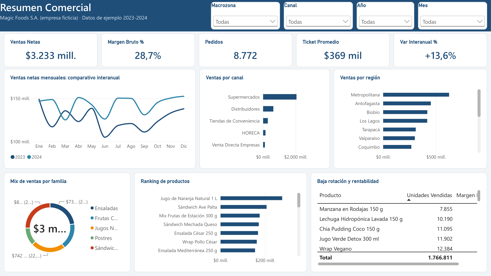</td>
    <td width="50%">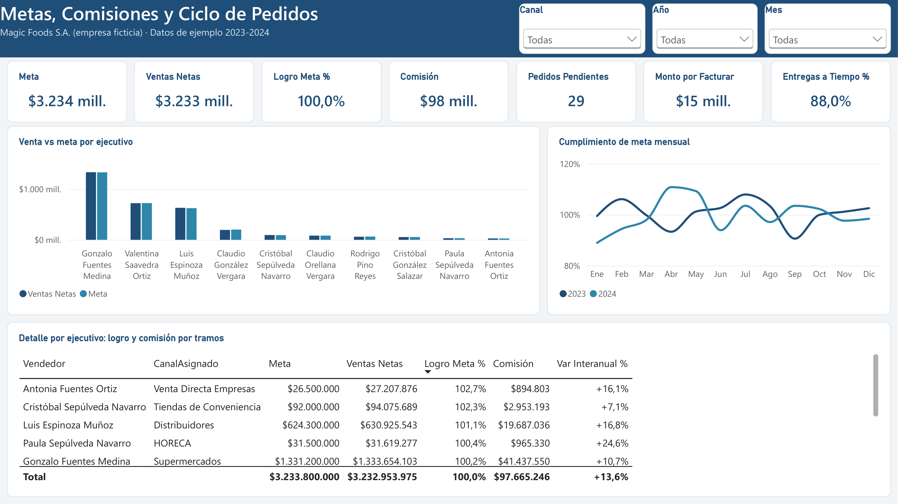</td>
  </tr>
  <tr>
    <td align="center"><em>Resumen Comercial</em></td>
    <td align="center"><em>Metas, comisiones y ciclo de pedidos</em></td>
  </tr>
  <tr>
    <td width="50%">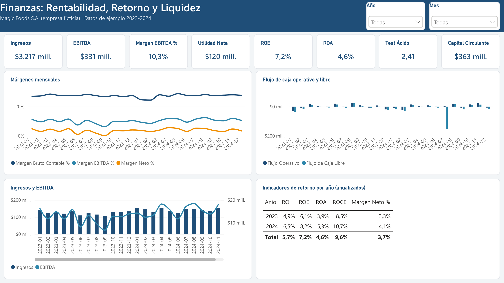</td>
    <td width="50%">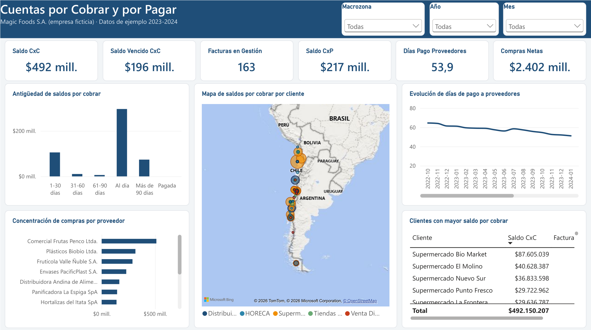</td>
  </tr>
  <tr>
    <td align="center"><em>Finanzas: rentabilidad, retorno y liquidez</em></td>
    <td align="center"><em>Cuentas por cobrar y por pagar, con mapa de Chile</em></td>
  </tr>
  <tr>
    <td width="50%">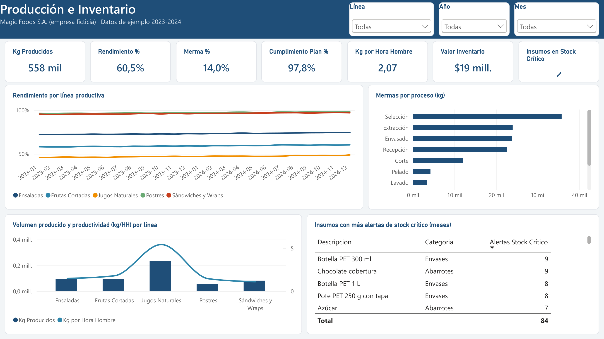</td>
    <td width="50%">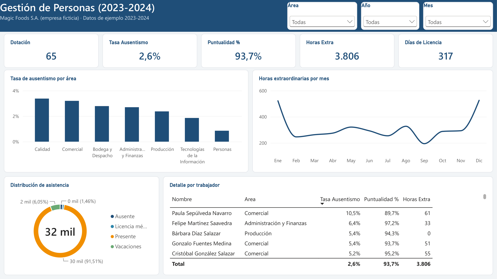</td>
  </tr>
  <tr>
    <td align="center"><em>Producción e inventario</em></td>
    <td align="center"><em>Gestión de personas 2023–2024</em></td>
  </tr>
  <tr>
    <td colspan="2" align="center">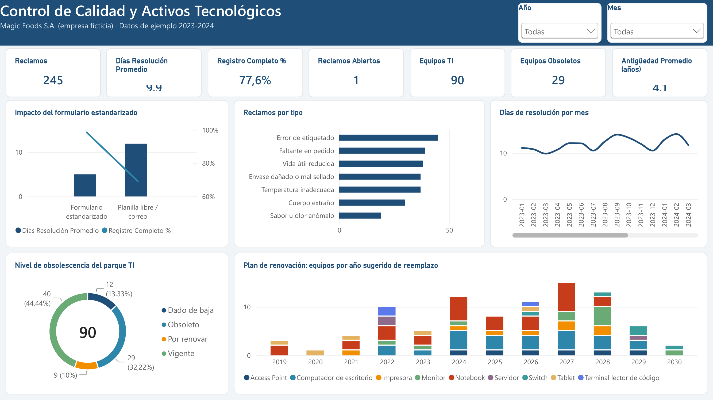</td>
  </tr>
  <tr>
    <td colspan="2" align="center"><em>Control de calidad y activos tecnológicos</em></td>
  </tr>
</table>

### El modelo de datos

Modelo estrella con una tabla calendario construida en Power Query y relaciones por clave entre hechos y dimensiones:

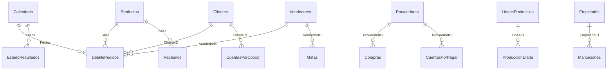
```mermaid
erDiagram
    Calendario ||--o{ DetallePedidos : Fecha
    Productos  ||--o{ DetallePedidos : SKU
    Clientes   ||--o{ DetallePedidos : ClienteID
    Vendedores ||--o{ DetallePedidos : VendedorID
    Vendedores ||--o{ Metas : VendedorID
    Clientes   ||--o{ CuentasPorCobrar : ClienteID
    Proveedores ||--o{ Compras : ProveedorID
    Proveedores ||--o{ CuentasPorPagar : ProveedorID
    LineasProduccion ||--o{ ProduccionDiaria : LineaID
    Productos  ||--o{ Reclamos : SKU
    Empleados  ||--o{ Marcaciones : EmpleadoID
    Calendario ||--o{ EstadoResultados : Fecha
```

Algunas medidas DAX del modelo:

```dax
Var Interanual % =
VAR y = MAX ( Calendario[Anio] )
VAR act = CALCULATE ( [Ventas Netas], Calendario[Anio] = y )
VAR ant = CALCULATE ( [Ventas Netas], Calendario[Anio] = y - 1 )
RETURN DIVIDE ( act - ant, ant )

Comisión =
SUMX (
    SUMMARIZE ( Metas, Vendedores[VendedorID], Calendario[AnioMes] ),
    VAR v = [Ventas Netas]
    VAR l = DIVIDE ( v, [Meta] )
    RETURN v * SWITCH ( TRUE (), l >= 1.1, 0.045, l >= 1, 0.035, l >= 0.95, 0.025, l >= 0.8, 0.015, 0 )
)

Tasa Ausentismo =
DIVIDE (
    CALCULATE ( COUNTROWS ( Marcaciones ), Marcaciones[Estado] IN { "Ausente", "Licencia médica" } ),
    CALCULATE ( COUNTROWS ( Marcaciones ), Marcaciones[Estado] <> "Vacaciones" )
)
```

---

## 🗺️ Los mismos dashboards en Tableau

Cada página de Power BI tiene su **réplica 1:1 en Tableau**: las mismas tarjetas KPI, los mismos gráficos, las mismas tablas de detalle, los mismos filtros y la misma disposición en pantalla. El objetivo es mostrar que un mismo requerimiento de negocio se puede implementar con igual resultado en ambas plataformas, resolviendo cada pieza con las herramientas propias de cada una.

| Elemento | En Power BI | En Tableau |
|---|---|---|
| Filtros globales (año, mes, macrozona, canal, línea, área) | Segmentaciones de datos sobre el modelo relacionado | **Parámetros** con lista desplegable y campos calculados de filtro, para que actúen sobre todas las hojas aunque usen fuentes distintas |
| Indicadores | Medidas DAX | **Campos calculados** agregados, por ejemplo `SUM([Ausencia]) / SUM([DiaComputable])` para el ausentismo |
| Variación interanual y saldos del último mes | `CALCULATE` con contexto de filtro modificado | Cálculos condicionados al parámetro de año y mes, sin depender del filtro de fecha |
| Comisión por tramos | `SUMX` sobre ejecutivo y mes | Cálculo fila a fila por ejecutivo y mes, agregado con `SUM` |
| Varias series en un gráfico (márgenes, venta vs meta, flujo de caja) | Varias medidas en el mismo eje | **Nombres y Valores de medidas** |
| Gráficos combinados (ingresos y EBITDA, volumen y productividad) | Gráfico de columnas y líneas | **Doble eje** con marcas distintas por eje |
| Tablas de detalle | Visual de tabla | Tabla de texto con Nombres de medidas en columnas y orden manual |
| Mapa de saldos por cliente | Visual de mapa | **Roles geográficos** de latitud y longitud sobre mapa de fondo |

<table>
  <tr>
    <td width="50%">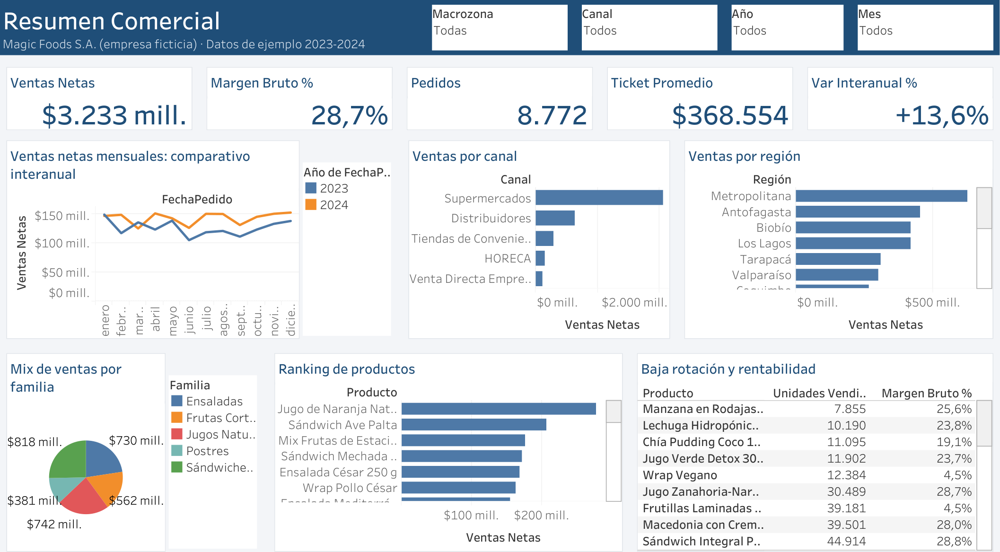</td>
    <td width="50%">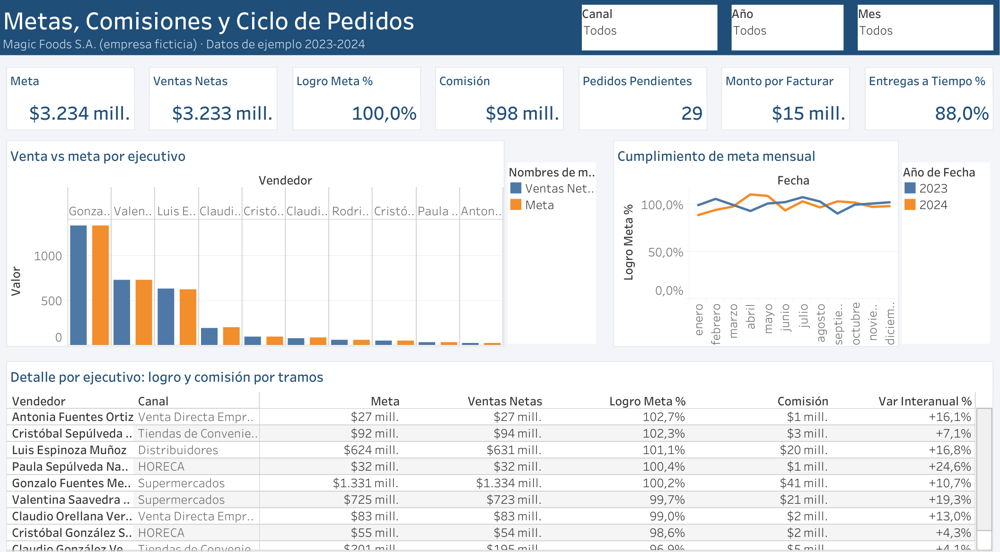</td>
  </tr>
  <tr>
    <td align="center"><em>Resumen Comercial</em></td>
    <td align="center"><em>Metas, comisiones y ciclo de pedidos</em></td>
  </tr>
  <tr>
    <td width="50%">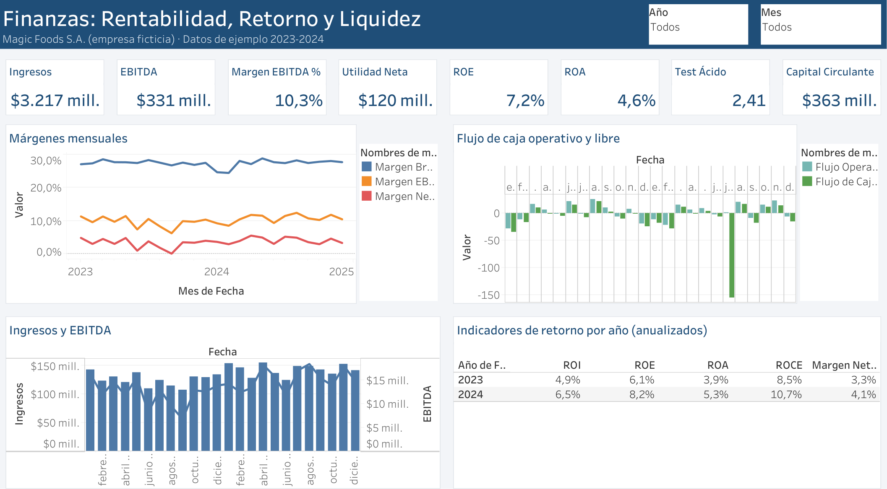</td>
    <td width="50%">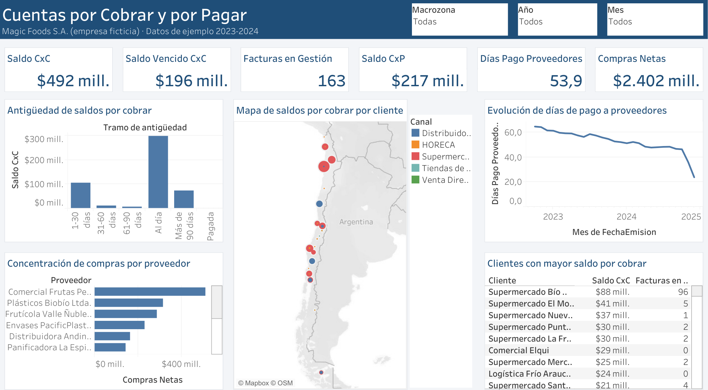</td>
  </tr>
  <tr>
    <td align="center"><em>Finanzas</em></td>
    <td align="center"><em>Cuentas por cobrar y por pagar</em></td>
  </tr>
  <tr>
    <td width="50%">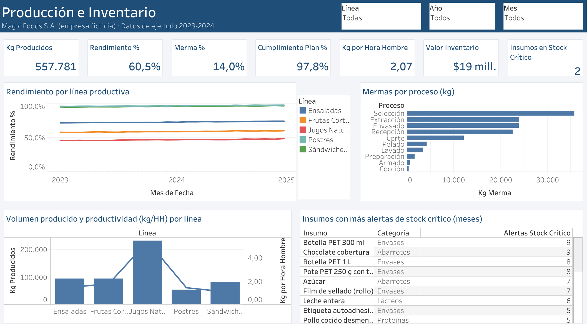</td>
    <td width="50%">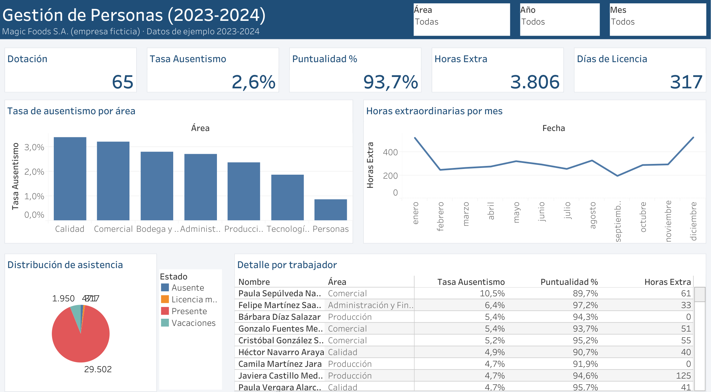</td>
  </tr>
  <tr>
    <td align="center"><em>Producción e inventario</em></td>
    <td align="center"><em>Gestión de personas 2023–2024</em></td>
  </tr>
  <tr>
    <td colspan="2" align="center">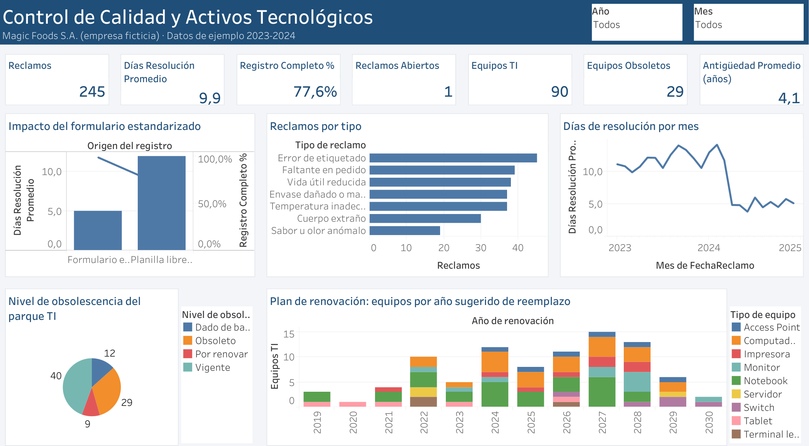</td>
  </tr>
  <tr>
    <td colspan="2" align="center"><em>Control de calidad y activos tecnológicos</em></td>
  </tr>
</table>

---

## 🧾 Presentaciones ejecutivas

Cada dashboard tiene su propia presentación en PowerPoint, con el diseño de **Studios Conari** y la vista del dashboard **en Power BI y en Tableau**. Todas siguen el mismo hilo: **por qué** se analiza el área, **qué** se busca controlar, **qué pasó** entre 2023 y 2024, y **qué medidas** tomar o planificar.

| Presentación | Hallazgo principal |
|---|---|
| [01 · Comercial](Presentaciones/01_Dashboard_Comercial.pptx) | Las ventas crecen 13,6%, pero por un ticket más alto y no por más pedidos; la zona Austral cae y un producto estrella deja solo 3% de margen |
| [02 · Metas y Pedidos](Presentaciones/02_Dashboard_Metas_y_Pedidos.pptx) | Las comisiones suben 14% aunque el logro anual del equipo cae a 99,5%; la puntualidad de entrega retrocede en la zona Sur |
| [03 · Finanzas](Presentaciones/03_Dashboard_Finanzas.pptx) | El EBITDA crece 24,5% y el ROE pasa de 6,1% a 8,2%, pero la caja cae 81% por la inversión en una nueva línea productiva |
| [04 · Cobranza y Proveedores](Presentaciones/04_Dashboard_Cobranza_y_Proveedores.pptx) | El 40% de la cartera está vencida y el Norte concentra más de la mitad; a los proveedores se les paga cada vez más puntual |
| [05 · Producción e Inventario](Presentaciones/05_Dashboard_Produccion_e_Inventario.pptx) | El rendimiento de materia prima sube 1,4 pp, pero las alertas de stock crítico aumentan 21% |
| [06 · Gestión de Personas](Presentaciones/06_Dashboard_Gestion_de_Personas.pptx) | Mejoran la puntualidad y las ausencias injustificadas; suben 24% las horas extra y el ausentismo del área comercial casi se duplica |
| [07 · Calidad y Activos TI](Presentaciones/07_Dashboard_Calidad_y_Activos_TI.pptx) | El formulario estandarizado reduce la resolución de reclamos de 11,9 a 5 días; un tercio del parque TI está obsoleto |

<table>
  <tr>
    <td width="33%">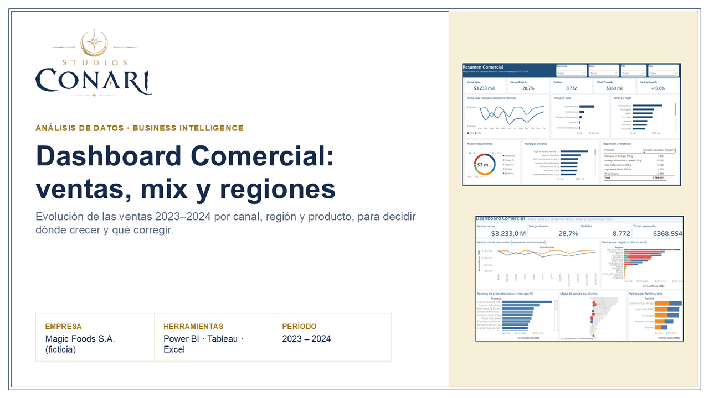</td>
    <td width="33%">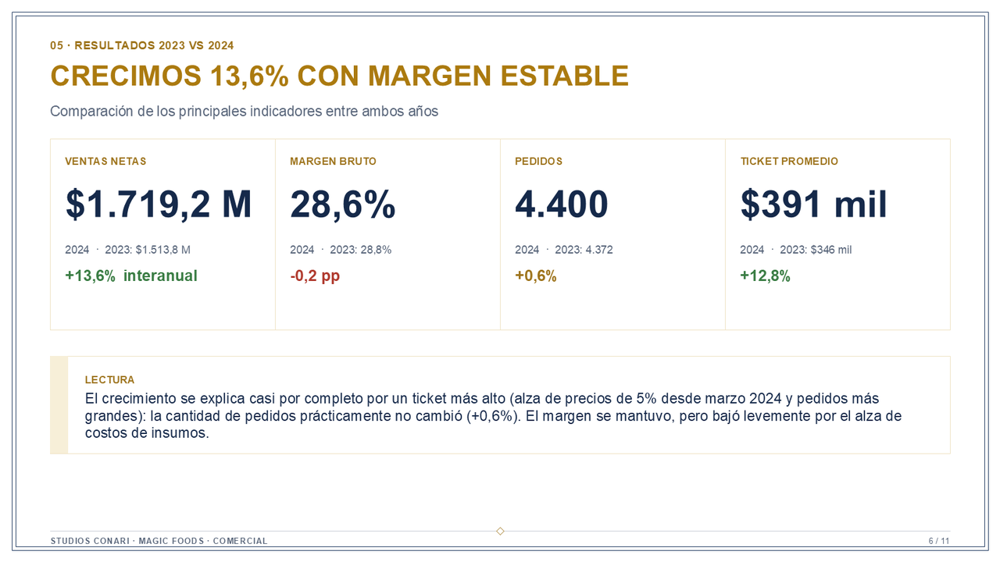</td>
    <td width="33%">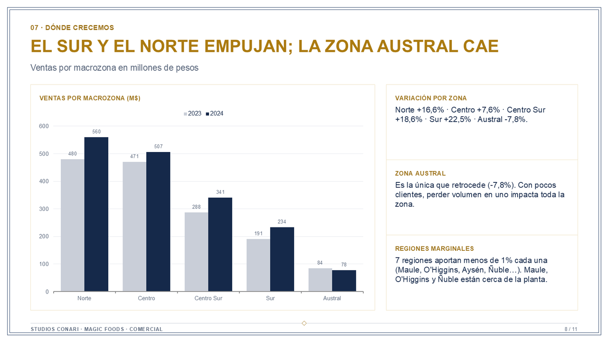</td>
  </tr>
  <tr>
    <td align="center"><em>Portada</em></td>
    <td align="center"><em>Resultados 2023 vs 2024</em></td>
    <td align="center"><em>Comportamiento mensual</em></td>
  </tr>
  <tr>
    <td width="33%">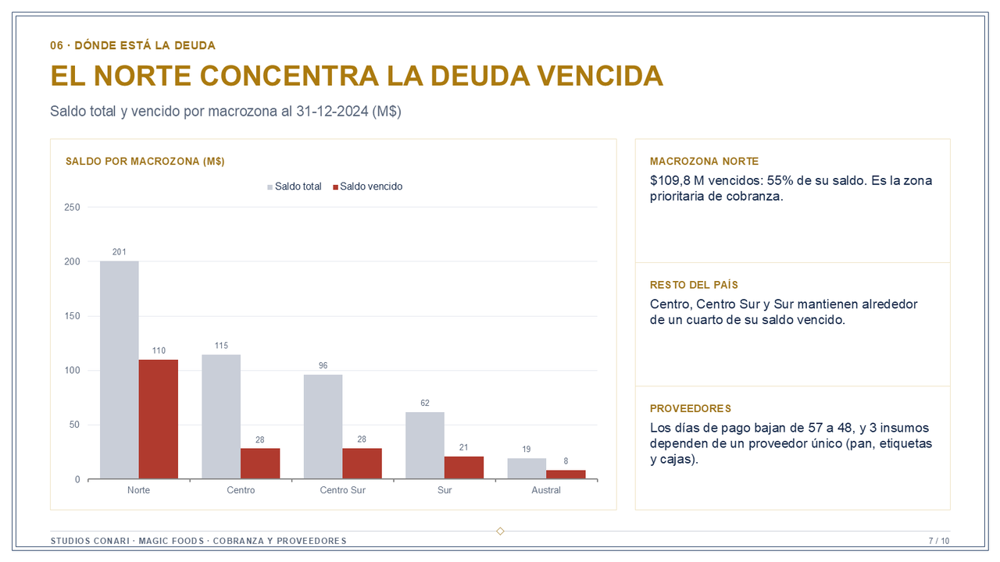</td>
    <td width="33%">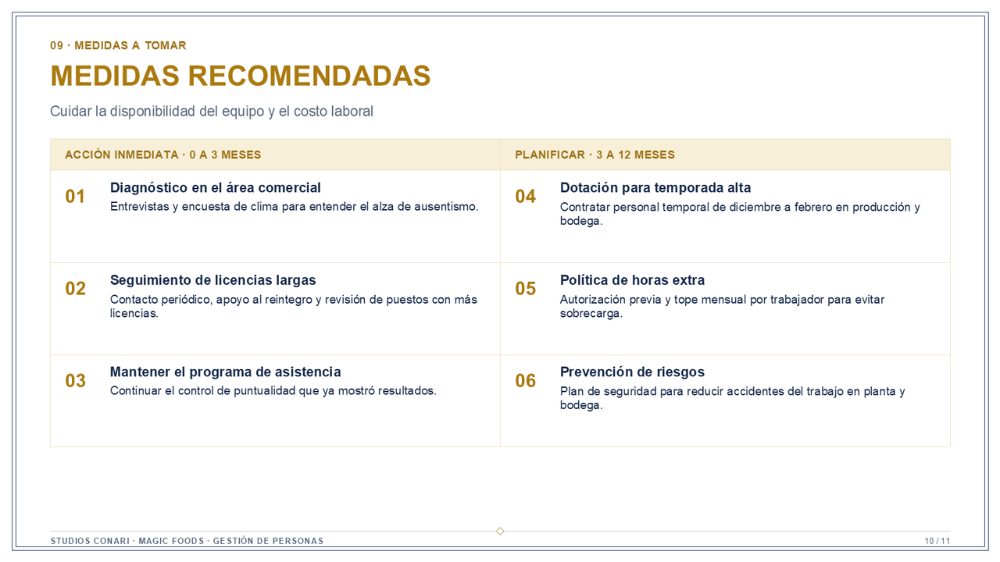</td>
    <td width="33%">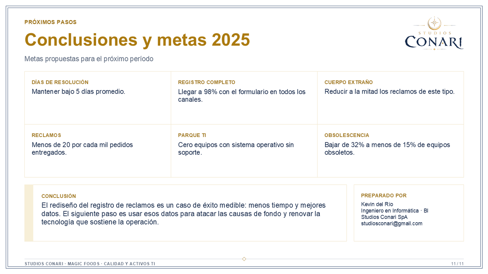</td>
  </tr>
  <tr>
    <td align="center"><em>Hallazgos clave</em></td>
    <td align="center"><em>Medidas inmediatas y a planificar</em></td>
    <td align="center"><em>Conclusiones y metas 2025</em></td>
  </tr>
</table>

---

## 🗃️ Los datos

Ocho libros de Excel en [`datos_ejemplo_MagicFoods/`](datos_ejemplo_MagicFoods). Cada uno tiene una hoja **LEEME** con la descripción de las tablas, los indicadores sugeridos y el diccionario de columnas.

| Archivo | Contenido | Volumen |
|---|---|---|
| `00_Maestros.xlsx` | Productos, clientes geolocalizados, vendedores, empleados, proveedores, insumos y calendario | 30 SKU · 90 clientes · 65 personas |
| `01_Comercial.xlsx` | Pedidos, detalle de ventas, metas y cálculo de comisiones por tramo | 8.891 pedidos · 33.231 líneas |
| `02_Finanzas.xlsx` | Estado de resultados, balance, flujo de caja, indicadores, cuentas por cobrar y por pagar | 24 meses · 9.808 facturas |
| `03_Inventario_Abastecimiento.xlsx` | Órdenes de compra y stock mensual con alertas de stock crítico | 2.800 órdenes |
| `04_Produccion.xlsx` | Producción diaria por SKU, dotación y horas hombre por línea, mermas por proceso | 13.102 registros |
| `05_Calidad.xlsx` | Reclamos con lote y acción correctiva, más un formulario de ingreso con validación de datos | 245 reclamos |
| `06_Personas.xlsx` | Marcaciones diarias, licencias, vacaciones y resumen por trabajador | 32.240 marcaciones |
| `07_Activos_TI.xlsx` | Parque computacional con antigüedad, vida útil y nivel de obsolescencia | 90 equipos |

**Patrones incorporados a propósito:** estacionalidad de verano en jugos y frutas · crecimiento interanual cercano a 8% · alza de precios en marzo de 2024 · productos de baja rotación y bajo margen · distribución regional desigual · clientes morosos · inversión en una nueva línea financiada con deuda · reducción de los plazos de pago a proveedores · formulario de reclamos desde abril de 2024 · programa de control de asistencia en 2024.

**Controles de calidad:** el balance cuadra en los 24 meses (activo = pasivo + patrimonio), el flujo de caja concilia con la variación de caja y las fórmulas de Excel se recalculan sin errores.

---

## 🔎 Cómo explorarlo

- **Power BI:** abre `PowerBI/MagicFoods.pbip`, ajusta el parámetro `RutaDatos` a la carpeta `datos_ejemplo_MagicFoods` en tu equipo y pulsa **Actualizar**.
- **Tableau:** abre `Tableau/MagicFoods.twb`; si lo pide, indica la ubicación de `Tableau/MagicFoods_Tableau.xlsx`.
- **Presentaciones:** están listas para abrir en `Presentaciones/`.

---

## 📁 Estructura

```
datos_ejemplo_MagicFoods/   Los 8 libros de Excel con datos, fórmulas y diccionario
PowerBI/
  MagicFoods.pbip           Proyecto de Power BI
  MagicFoods.SemanticModel/ Modelo en TMDL: tablas, relaciones y 60 medidas DAX
  MagicFoods.Report/        Informe en PBIR: 7 páginas y tema visual
Tableau/
  MagicFoods.twb            Libro de Tableau con 7 dashboards y 76 hojas
  MagicFoods_Tableau.xlsx   Datos planos para Tableau
Presentaciones/             7 presentaciones ejecutivas en PowerPoint
docs/
  capturas/                 Imágenes de los dashboards
  presentaciones/           Vistas previas de las diapositivas
```

---

## Estado

Proyecto de portafolio **completo**: datos, modelo, dashboards en dos herramientas y presentaciones ejecutivas. Refleja el alcance funcional de la plataforma de BI que implementé en la industria, sin exponer información de la empresa.

## Créditos

Análisis, modelamiento, dashboards y presentaciones: **Kevin del Río** — [Studios Conari](https://studiosconari.github.io/).

<div align="center">

[](https://www.linkedin.com/in/kevindelrio)
[](https://github.com/KdelRio)
[](https://studiosconari.github.io/)

</div>
